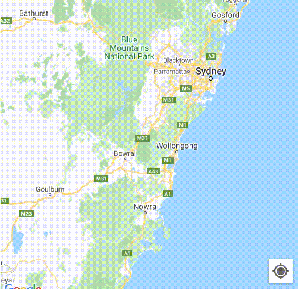
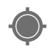
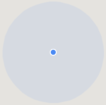
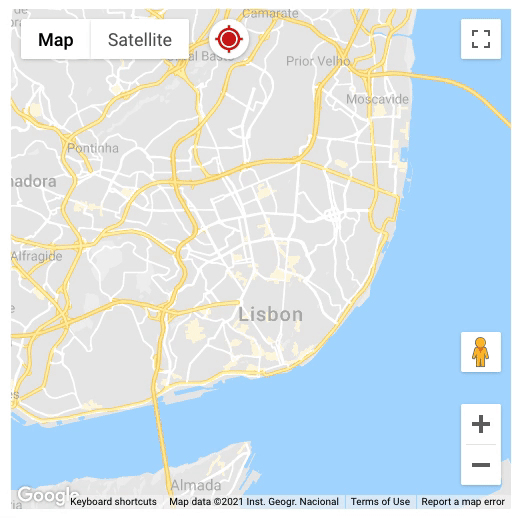

# Google Maps Current Location

[![Latest version][npm-version-badge]][npm-url]
[![npm][npm-downloads-badge]][npm-url]

Click on *your location* and display the geographic location of a user or device on a Google map.

<p align="center">
    
</p>

- [Usage](#usage)
- [Props](#props)
- [Examples](#examples)

Usage
--------------------------------------------------------------------------------

Install the library and add it to your code:
```sh
npm install google-maps-current-location
```

```js
import addCurrentLocation from 'google-maps-current-location'

// ...

addCurrentLocation(map)

```

or add it directly to your .html file using [unpkg](https://unpkg.com/): 

```html
<script src="https://unpkg.com/google-maps-current-location"></script>

<script>
  // ...
  
  addCurrentLocation(map)

</script>
```

Props
--------------------------------------------------------------------------------

```js
addCurrentLocation(map, options)
```

### Required

`map` represents a google.maps.Map.  
Check out how to configure it [here](https://developers.google.com/maps/documentation/javascript/overview).

### Optional

`options` is an object with the following elements: 
- [buttonStyle](#1-buttonStyle): object
- [markerStyle](#2-markerStyle): object
- [showAccuracyRadius](#3-showAccuracyRadius): boolean
- [watchPositionFn](#4-watchPositionFn): function

#### 1. buttonStyle
Configures the css and positioning of the button displayed over the map.

<p>
    
</p>

Prop | Type  | Description | Default
---- | ----| ----------- | -------
`buttonPosition` | google.maps.ControlPosition | Position of button in relation with map. Check [here](https://developers.google.com/maps/documentation/javascript/controls#ControlPositioning) to find out more. | google.maps.ControlPosition.RIGHT_BOTTOM
`mainMargin`| string |	The button's margin	| 10px
`backgroundColor`|string| The button's background color. All CSS3 colors are supported|#fff
`symbolColor`|string|The symbol's fill color. Only HEX color supported|#6F6F6F
`border`|string|The button's border|0px
`borderRadius`|string|The button's border radius|0px
`outline`|string|The button's outline|0px
`height`|string|The button's height (height===width)|40px
`boxShadow`|string|The button's boxShadow|0 1px 4px rgba(0,0,0,0.3)
`cursor`|string|Mouse cursor type to show on hover|pointer


#### 2. markerStyle
Configures the css of the marker displayed over the map, on the current location coordinates. To learn more about `google.maps.Marker` click [here](https://developers.google.com/maps/documentation/javascript/reference/marker#MarkerOptions).

<p>
    
</p>

Prop | Type | Description | Default
---- | ----| ----------- | -------
`clickable`|boolean|If true, the marker receives mouse and touch events|false
`cursor`|string|Mouse cursor type to show on hover|pointer
`draggable`|boolean|If true, the marker can be dragged| false
`fillColor`|string|The symbol's fill color. All CSS3 colors are supported except for extended named colors|#4A89F3
`scale`|number|The amount by which the symbol is scaled in size|6
`strokeWeight`|number|The symbol's stroke weight|2
`strokeColor`|string|The symbol's stroke color. All CSS3 colors are supported except for extended named colors|white

#### 3. showAccuracyRadius
If true, a shape that grows with position accuracy is showed.  
Default value is *true*.

#### 4. watchPositionFn
Set up a watch for location changes. This function returns a `number` or `Promise<number>` to represent an integer ID that identifies the registered handler.  
Default function uses [navigator.geolocation.watchPosition](https://developer.mozilla.org/en-US/docs/Web/API/Geolocation/watchPosition).

Prop | Description 
---- |  ----------- 
`successCallback`|Required. A callback function that takes a [GeolocationPosition](https://developer.mozilla.org/en-US/docs/Web/API/GeolocationPosition) object as an input parameter.
`errorCallback`|Optional. An optional callback function that takes a [GeolocationPositionError](https://developer.mozilla.org/en-US/docs/Web/API/GeolocationPositionError) object as an input parameter.
`options`|Optional. An optional [PositionOptions](https://developer.mozilla.org/en-US/docs/Web/API/PositionOptions) object that provides configuration options for the location watch.

Examples
--------------------------------------------------------------------------------

- [Basic](#basic)
- [Button and Marker Style](#button-and-marker-style)
- [Watch Position Function](#watch-position-function)
### Basic

**React:**

```js
import React from 'react';
import addCurrentLocation from 'google-maps-current-location'

export default function App() {

  React.useEffect(()=>{
    const mapEl = document.getElementById('map');
    if (!mapEl) {
      throw new Error('Cannot get map element');
    }

    const map = new google.maps.Map(mapEl, {
      center: new google.maps.LatLng(41.1493987, -8.1900724),
      zoom: 12,
      disableDefaultUI: true,
    });

    addCurrentLocation(map)
  
  }, []);

  return (
    <div className="App">
      <div id="map" />
    </div>
  );
}
```

**Html:**

```html
<!DOCTYPE html>
<html>

  <head>
    <meta name="viewport" content="width=device-width, initial-scale=1.0">
     <script async
        src="https://maps.googleapis.com/maps/api/js?key=YOUR-KEY&callback=initMap&libraries=&v=weekly&lng=en"></script>
    <script src="https://unpkg.com/google-maps-current-location"></script>

    <script>
      let map;

      function initMap() {
        map = new google.maps.Map(document.getElementById("map"), {
            center: { lat: -34.397, lng: 150.644 },
            zoom: 8,
            disableDefaultUI: true,
        });

        addCurrentLocation(map)
      }
    </script>
  </head>

  <body>
    <div id="map" style="height:500px; width:500px"></div>
  </body>

</html>
```

### Button and Marker Style

```js

addCurrentLocation(map, {
  buttonStyle: {
    buttonPosition: google.maps.ControlPosition.TOP_LEFT,
    symbolColor: '#CE1919', // red,
    borderRadius: '50%',
  },
  markerStyle: {
    fillColor: 'green',
    scale: 10,
  }
})
  
```

<p align="center">
    
</p>

### Watch Position Function

This example implements the [Capacitor Geolocation Plugin](https://capacitorjs.com/docs/apis/geolocation#watchposition).

```js
import {Geolocation} from '@capacitor/geolocation';
import addCurrentLocation from 'google-maps-current-location'

// ...

const watchPositionFn = async (updatePos, setError) => {
  return await Geolocation.watchPosition({enableHighAccuracy: true}, (pos, err) => {
    if (err) {
      setError(err);
      return;
    }
    updatePos(pos);
  });
}

addCurrentLocation(map, {
  watchPositionFn
})

```

[npm-version-badge]: https://img.shields.io/npm/v/google-maps-current-location
[npm-downloads-badge]: https://img.shields.io/npm/dm/google-maps-current-location
[npm-url]: https://www.npmjs.org/package/google-maps-current-location